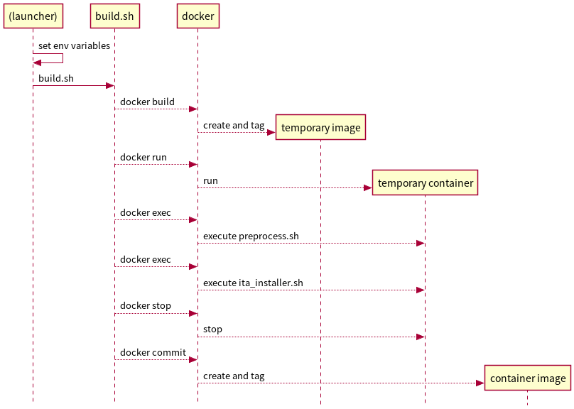

# リポジトリ`it-automation-container`の仕様

## はじめに

ここでは、Exastro IT Automationのコンテナを作成するためのリポジトリである、`it-automation-container`の仕様を解説する。


## ディレクトリ構成

プロジェクト`it-automation-container`のディレクトリ構成は以下の通り。
Exastro IT Automationのバージョン番号のディレクトリ`[VERSION]`の下にベースイメージのサブディレクトリ`[BASE_IMAGE]`を配置する。


```
it-automation-container
|-- [VERSION]
|   |-- [BASE_IMAGE]
|   |-- [BASE_IMAGE]
|   :
|
|-- [VERSION]
|   |-- [BASE_IMAGE]
|   |-- [BASE_IMAGE]
:   :
```

具体的には、以下のようなディレクトリ構成になる。

```
it-automation-container
|-- 1.6.1
|   |-- centos8
|   `-- ubi8
|-- 1.6.2
|   |-- centos8
|   `-- ubi8
:
```


## ビルドスクリプト

ビルドスクリプトは、ベースイメージのサブディレクトリ`[BASE_IMAGE]`に集約する。
必須のスクリプトは以下のとおり。


| スクリプト      | 説明 |
| --------------- | ---- |
| `build.sh`      | ビルドの中核となるスクリプト。Dockerfileを利用して下地となるコンテナイメージを作成後、preprocess.shとExastro IT Automationのインストーラを実行して、コンテナイメージを構築する。 |
| `Dockerfile`    | ベースイメージに対して、メタ情報の付与やコンフィギュレーションを実施して、Exastro IT Automationのコンテナの下地を作る。OSレベルの設定やコマンドの実行などはDockerfileの中では実施せずに、preprocess.shの中で実施する。 |
| `preprocess.sh` | Exastro IT Automationのインストーラを実行するための事前準備を実施するスクリプト。例えば、ロケールなどのOSの設定、必要パッケージのインストール、Exastro IT Automationのインストーラのダウンロードとアンパックなどを実施する。 |

ビルドのシーケンスを以下の図で示す。`build.sh`がdockerを実行して一時的なコンテナイメージとコンテナを作成し、`preprocess.sh`と`ita_installer.sh`を実行して最終的なコンテナイメージを作成する。



ここで、図中の`(launcher)`はスクリプト`build.sh`を実行するものであるが、GitHub Actionsを利用する場合はワークフローに、ローカル環境の場合は後続で説明するスクリプト`local-build.sh`になる。

次に、以下にローカルの環境でビルドする場合のヘルパースクリプトを示す。
これらのスクリプトは主に打鍵を減らして開発を効率化することが目的なので、必ずしも存在する必要はない。

| スクリプト       | 説明 |
| ---------------- | ---- |
| `local-build.sh` | 環境変数をいくつか設定した後、`build.sh`を呼び出す。 |
| `clean.sh`       | `build.sh`によって作成された一時的なコンテナイメージとコンテナを削除し、再度`build.sh`を実行できる状態にする。 |
| `run.sh`         | `build.sh`によって作成された最終的なコンテナイメージを利用して、テストのためにコンテナを実行する。 |


## 自動ビルド

TODO

## DockerHubとタグ名

TODO
