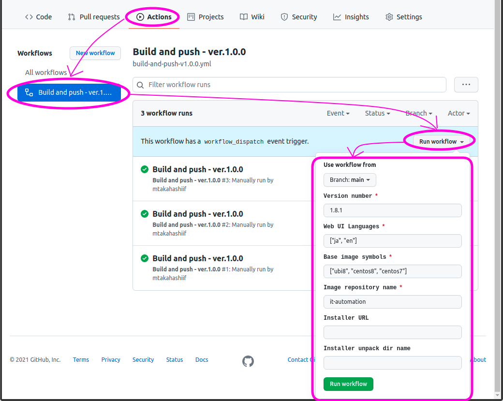
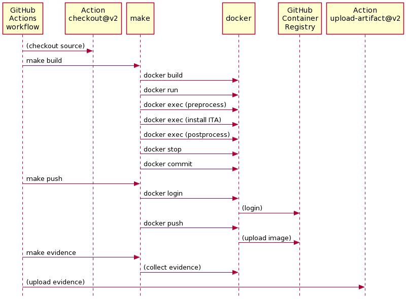

# リポジトリ`it-automation-container`のビルドとCIの方式

<!-- START doctoc generated TOC please keep comment here to allow auto update -->
<!-- DON'T EDIT THIS SECTION, INSTEAD RE-RUN doctoc TO UPDATE -->

- [はじめに](#%E3%81%AF%E3%81%98%E3%82%81%E3%81%AB)
- [CI (Continuous Integration)](#ci-continuous-integration)
  - [CIの範囲](#ci%E3%81%AE%E7%AF%84%E5%9B%B2)
  - [ワークフロー](#%E3%83%AF%E3%83%BC%E3%82%AF%E3%83%95%E3%83%AD%E3%83%BC)
  - [コンテナイメージの構成パターンの方針](#%E3%82%B3%E3%83%B3%E3%83%86%E3%83%8A%E3%82%A4%E3%83%A1%E3%83%BC%E3%82%B8%E3%81%AE%E6%A7%8B%E6%88%90%E3%83%91%E3%82%BF%E3%83%BC%E3%83%B3%E3%81%AE%E6%96%B9%E9%87%9D)
- [コンテナレジストリ](#%E3%82%B3%E3%83%B3%E3%83%86%E3%83%8A%E3%83%AC%E3%82%B8%E3%82%B9%E3%83%88%E3%83%AA)
- [共通のビルドの方式](#%E5%85%B1%E9%80%9A%E3%81%AE%E3%83%93%E3%83%AB%E3%83%89%E3%81%AE%E6%96%B9%E5%BC%8F)
  - [リポジトリのディレクトリ構成](#%E3%83%AA%E3%83%9D%E3%82%B8%E3%83%88%E3%83%AA%E3%81%AE%E3%83%87%E3%82%A3%E3%83%AC%E3%82%AF%E3%83%88%E3%83%AA%E6%A7%8B%E6%88%90)
  - [ツールチェーン](#%E3%83%84%E3%83%BC%E3%83%AB%E3%83%81%E3%82%A7%E3%83%BC%E3%83%B3)
- [All in One構成のビルドの方式](#all-in-one%E6%A7%8B%E6%88%90%E3%81%AE%E3%83%93%E3%83%AB%E3%83%89%E3%81%AE%E6%96%B9%E5%BC%8F)
  - [コンテナイメージのリポジトリ名](#%E3%82%B3%E3%83%B3%E3%83%86%E3%83%8A%E3%82%A4%E3%83%A1%E3%83%BC%E3%82%B8%E3%81%AE%E3%83%AA%E3%83%9D%E3%82%B8%E3%83%88%E3%83%AA%E5%90%8D)
  - [コンテナイメージのタグ名](#%E3%82%B3%E3%83%B3%E3%83%86%E3%83%8A%E3%82%A4%E3%83%A1%E3%83%BC%E3%82%B8%E3%81%AE%E3%82%BF%E3%82%B0%E5%90%8D)
  - [GitHub Container Registryに登録するコンテナイメージ](#github-container-registry%E3%81%AB%E7%99%BB%E9%8C%B2%E3%81%99%E3%82%8B%E3%82%B3%E3%83%B3%E3%83%86%E3%83%8A%E3%82%A4%E3%83%A1%E3%83%BC%E3%82%B8)
  - [DockerHubに登録するコンテナイメージ](#dockerhub%E3%81%AB%E7%99%BB%E9%8C%B2%E3%81%99%E3%82%8B%E3%82%B3%E3%83%B3%E3%83%86%E3%83%8A%E3%82%A4%E3%83%A1%E3%83%BC%E3%82%B8)
  - [ビルドの方式](#%E3%83%93%E3%83%AB%E3%83%89%E3%81%AE%E6%96%B9%E5%BC%8F)
  - [ビルドに必要なファイル](#%E3%83%93%E3%83%AB%E3%83%89%E3%81%AB%E5%BF%85%E8%A6%81%E3%81%AA%E3%83%95%E3%82%A1%E3%82%A4%E3%83%AB)
- [HA構成のビルドの方式](#ha%E6%A7%8B%E6%88%90%E3%81%AE%E3%83%93%E3%83%AB%E3%83%89%E3%81%AE%E6%96%B9%E5%BC%8F)
- [付録](#%E4%BB%98%E9%8C%B2)
  - [ビルドされるコンテナイメージ一覧](#%E3%83%93%E3%83%AB%E3%83%89%E3%81%95%E3%82%8C%E3%82%8B%E3%82%B3%E3%83%B3%E3%83%86%E3%83%8A%E3%82%A4%E3%83%A1%E3%83%BC%E3%82%B8%E4%B8%80%E8%A6%A7)

<!-- END doctoc generated TOC please keep comment here to allow auto update -->


# はじめに

このドキュメントでは、リポジトリ`it-automation-container`を利用したExastro IT AutomationのコンテナのビルドとCIの方式について説明する。
そのため、以下の内容についてはこのドキュメントの範疇外であり、基本的には説明はしない。

  * GitHubの操作手順
  * ビルド環境の運用手順
  * Exastro IT Automationのコンテナの仕様や利用方法


# CI (Continuous Integration)

このリポジトリでは、GitHub Actionsを利用してCIを実施する。

## CIの範囲

このリポジトリにおける、CIの範囲は以下である。
なお、現時点ではコンテナイメージのテストは省略しており、将来実現する予定である。

  * コンテナイメージのビルド
  * コンテナイメージのテスト
  * コンテナイメージのコンテナレジストリへの登録


## コンテナイメージの構成パターンの方針

Exastro IT Automationの構築方法にはいくつかの選択肢があるため、特定のひとつのバージョンであっても、複数のコンテナイメージを作成する必要がある。
現時点の構成方法の選択肢は、以下の2つの軸がある。

  * Web UIで表示する言語
  * ベースイメージ

例えば、言語について日本語と英語の2つの選択肢があり、またベースイメージについてCentOS 8とUBI 8の2つの選択肢がある場合には、次の4パターンのコンテナイメージの作成が必要になる。

  * 日本語、CentOS 8
  * 日本語、UBI 8
  * 英語、CentOS 8
  * 英語、UBI 8

そのため、CIで特定のひとつのバージョンをビルドする際には、すべての構成パターンを作成するように、ワークフローを構成する。


## ワークフロー

GitHub Actionsで利用するワークフローは、GitHub Actionsの仕様に従い、リポジトリの以下の場所に配置している。
現在はワークフローはひとつだけでVersion 1.0.0としているが、将来的にバージョンアップしたワークフローや、全く異なるワークフローを追加してもよい。

```
it-automation-container
`-- .github
    `-- workflows
        `-- build-and-push-v1.0.0.yml
```

ワークフローは以下の手順で実行する。
  1. リポジトリ`it-automation-container`でタブ「Actions」を選択
  1. ワークフロー「Build and push - ver.1.0.0」を選択
  1. ボタン「Run workflow」を押下
  1. 表示されたダイアログに必要な項目を入力し、緑色のボタン「Run workflow」を押下



ダイアログに入力する項目の説明を以下の表に示す。
「Version number」と「Base image symbols」と「Image repository name」については、後述するディレクトリ構造におけるディレクトリ名と一致する必要がある。

| 入力項目                  | 説明 | 入力値 |
| ------------------------- | ---- | ------ |
| Use workflow from         | どのブランチのワークフローを利用するか | 必ずmainを選択 |
| Version number            | ビルドするExastro IT Automationのバージョン番号 | 例：1.8.1 |
| Web UI Languages          | JSONの配列形式で表現した、Web UIで利用する言語群 | 例：["ja", "en"] |
| Base image symbols        | JSONの配列形式で表現した、ベースイメージのシンボル群 | 例：[ "centos8", "ubi8"] |
| Image repository name     | 作成するコンテナイメージのリポジトリ名。より正確には、リポジトリ名のパスの末尾の要素 | 例：it-automation |
| Installer URL             | インストーラをダウンロードするためのURL。通常はバージョン番号をもとにリリースページのURLを構築するため、値は入力しない。リリースページ以外から取得する場合、例えばmainブランチのheadのアーカイブを利用する場合等に、そのURLを指定する | インストーラの.tar.gzがダウンロードできるURL |
| Installer unpack dir name | インストーラの.tar.gzをアンパックした時に生成されるディレクトリ名。通常はリリースページからインストーラを取得するが、その場合はバージョン番号をもとにディレクトリ名が決定されるため、値は入力しない。リリースページ以外から取得する場合、例えばmainブランチのheadのアーカイブを利用する場合は`it-automation-main`のような別のディレクトリ名になるため、それを入力する | 例：it-automation-main |


# コンテナレジストリ

Exastro IT Automationのコンテナの公開には、以下の2つのコンテナレジストリを利用する。

  * GitHub Container Registry (ghcr.io)
  * DockerHub (registry-1.docker.io)

GitHub Container Registryは、CIの結果登録されるレジストリであり、開発用と位置づける。
そして、テストをパスしたコンテナイメージは、Exastro IT Automationのリリース版のコンテナイメージとして、DockerHubに登録する。
現時点では、DockerHubへの登録はCIの範疇外とし、マニュアルで登録する。


# 各構成に共通するビルドの方式

Exastro IT Automationのコンテナイメージの構成は、All in One構成やHA構成など複数の構成がある。
ここでは、各構成に共通するビルドの方式を説明する。


## リポジトリのディレクトリ構成

プロジェクト`it-automation-container`のディレクトリ構成は次のように構成する。
Exastro IT Automationのバージョン番号のディレクトリ`[VERSION]`の下に、作成するイメージのリポジトリ名`[IMAGE_REPO_NAME]`のディレクトリを配置し、更にその下にベースイメージの名前に基づいたサブディレクトリ`[BASE_IMAGE]`を配置する。
これを図示すると、以下のようになる。

```
it-automation-container
|-- [VERSION]
|   |-- [IMAGE_REPO_NAME]
|   |   |-- [BASE_IMAGE]
|   |   |-- [BASE_IMAGE]
|   |   :
|   |
|   |-- [IMAGE_REPO_NAME]
|   |   |-- [BASE_IMAGE]
|   |   |-- [BASE_IMAGE]
|   :   :
|
|-- [VERSION]
|   |-- [IMAGE_REPO_NAME]
|   |   |-- [BASE_IMAGE]
|   |   |-- [BASE_IMAGE]
|   |   :
|   |
|   |-- [IMAGE_REPO_NAME]
|   |   |-- [BASE_IMAGE]
|   |   |-- [BASE_IMAGE]
:   :   :
```

具体的な例を挙げると、以下のようなディレクトリ構成になる。
ここでの例は架空であり、実在のものとは異なることに注意。

```
it-automation-container
|-- 1.7.1
|   |-- it-automation
|   |   |-- centos8
|   |   `-- ubi8
|   `-- db-server
|       `-- alpine
|-- 1.7.2
|   |-- it-automation
|   |   |-- centos8
|   |   `-- ubi8
|   `-- db-server
|       `-- alpine
:
```


## ツールチェーン

コンテナイメージのビルドには、以下のツールを利用する。

  * Docker CLI
  * make

前述したディレクトリ構成において、末端のディレクトリである`[BASE_IMAGE]`に`Makefile`を準備する。
そして`make`を利用して、個々のコンテナイメージをビルドと、コンテナレジストリへの登録を実施する。


# All in One構成のビルドの方式

## コンテナイメージのリポジトリ名

どのコンテナレジストリに登録するかによってリポジトリ名は変化するが、リポジトリ名の末端は`it-automation`で固定とする。
具体的には、以下のようになる。

| コンテナレジストリ        | リポジトリ名                          |
| ------------------------- | ------------------------------------- |
| GitHub Container Registry | `ghcr.io/exastro-suite/it-automation` |
| DockerHub                 | `docker.io/exastro/it-automation`     |

なお、開発を容易に行うために、フォークしたGitHubリポジトリに対してもCI (GitHub Actions)を正しく実行できるようにする。
そのため、GitHub Container Registryへの登録については、`exastro-suite`の部分がフォーク先のアカウントなるように、ワークフローとMakefileを作成している。

例えば、GitHubのユーザ`mtakahashiif`が`it-automation-container`をフォークしてGitHub ActionsによるCIを実行した場合、つまり言い換えると https://github.com/mtakahashiif/it-automation-container でGitHub Actionsを実行した場合は、リポジトリ名`ghcr.io/mtakahashiif/it-automation`でコンテナイメージが登録される。


## コンテナイメージのタグ名

コンテナイメージの構成パターンには、以下のものがある。

| 項目           | 選択肢              |
| -------------- | ------------------- |
| Web UIの言語   | ja、en              |
| ベースイメージ | ubi8、centos8、など |

これらを踏まえて、タグ名のフォーマットは以下のように定める。

  * `[Exastro IT Automationのバージョン]-[Web UIの言語]-[ベースイメージ]`

具体例を以下に示す。

  * 1.8.1-ja-centos8
  * 1.9.0-en-ubi8


## GitHub Container Registryに登録するコンテナイメージ

CIを実行することによって、作成されたコンテナイメージがGitHub Container Registryに自動的に登録される。
コンテナイメージ名は、前述のリポジトリ名とタグ名をコロンで連結したものである。
具体例を挙げると、Exastro IT Automation v1.7.2の場合は、以下のようになる。

| 言語 | ベースイメージ | コンテナイメージ名                                     |
| ---- | -------------- | ------------------------------------------------------ |
| ja   | centos8        | `ghcr.io/exastro-suite/it-automation:1.7.2-ja-centos8` |
| ja   | ubi8           | `ghcr.io/exastro-suite/it-automation:1.7.2-ja-ubi8`    |
| en   | centos8        | `ghcr.io/exastro-suite/it-automation:1.7.2-en-centos8` |
| en   | ubi8           | `ghcr.io/exastro-suite/it-automation:1.7.2-en-ubi8`    |


## DockerHubに登録するコンテナイメージ

DockerHubに登録するコンテナイメージは、GitHub Container Registryに登録したコンテナイメージのうち、テストが完了したものである。
現時点では、テストと登録作業はマニュアルで実施する。

また、現時点ではベースイメージが`centos8`のものだけを登録することとする。
そしてコンテナイメージ名については、タグ名からベースイメージの部分を取り除くことによって、これまで公開してきたコンテナイメージ名にフォーマットに合わせる方針とする。
具体例を挙げると、Exastro IT Automation v1.7.2の場合は、以下のようになる。

| 言語 | ベースイメージ | コンテナイメージ名                             |
| ---- | -------------- | ---------------------------------------------- |
| ja   | centos8        | `ghcr.io/exastro-suite/it-automation:1.7.2-ja` |
| en   | centos8        | `ghcr.io/exastro-suite/it-automation:1.7.2-en` |

将来的には、採用するベースイメージを変更したり、GitHub Container Registryと同様にすべてのコンテナイメージを登録したりする可能性がある。


## ビルドの方式

GitHub Actionsを利用したビルドのシーケンスを以下の図で示す。
ワークフローから`make`を呼び出すことで、コンテナイメージのビルドとプッシュ、およびビルドのエビデンス取得を実施する。
そして最後に、取得したエビデンスをアーティファクトとしてアップロードする。



Exastro IT Automationのインストーラは、DBの初期化等のためにsystemdの各種サービスが起動していることを期待するため、Dockerfileの中から実行した場合はインストールは失敗に終わる。
この問題に対しては、Dockerfileを利用して最小限のコンテナイメージを作成した後、そのコンテナを起動し、`docker exec`でインストーラを実行することで対処している。
これは、上に示した図の`make build`の後に連なる`docker`コマンド群にあたる。

また、Exastro IT Automationのインストーラの実行を、事前処理(preprocess)と事後処理(postprocess)で挟み込むことにより、環境の調整や追加処理などを実行している。
特に、Exastro IT Automationのインストーラはまだ完全にはUBI 8には対応していないため、事前処理でインストーラの書き換えを行う必要がある。

ローカルの開発環境でビルドする場合は、`make build`を直接実行する。
`make build`を再実行する際は、事前に`make clean`を実行して中間生成物(ビルド中に`docker run`で生成されたコンテナ等)をクリアしておく必要がある。
中間生成物は、エビデンスの取得やデバッグの情報源として有益であるため、`make build`では削除せずに残しておく方針としている。


## ビルドに必要なファイル

ビルドに必要となるファイルには、後述するように`Makefile`や`Dockerfile`があるが、これらのファイルは以下に示すようにベースイメージのディレクトリに配置する。

```
it-automation-container
|-- [VERSION]
|   |-- [IMAGE_REPO_NAME]
|   |   |-- [BASE_IMAGE]
|   |   |   |-- Makefile
|   |   |   |-- Dockerfile
|   |   |   |-- preprocess.sh
|   |   |   |-- postprocess.sh
|   |   |   `-- docker-entrypoint.sh
|   |   |
|   |   |-- [BASE_IMAGE]
|   |   |   |-- Makefile
|   |   |   |-- Dockerfile
|   |   |   |-- preprocess.sh
|   |   |   |-- postprocess.sh
|   |   |   `-- docker-entrypoint.sh
:   :   :
```

ビルドに必要となるファイルの概要について、以下の表で説明する。

| ファイル        | 概要 |
| --------------- | ---- |
| `Makefile`      | ビルドの中核となるファイル。ワークフローが`make`を呼び出すため、少なくとも`build`、`push`、`evidence`の3つのターゲットを準備しておく必要がある。 |
| `Dockerfile`    | Exastro IT Automationをインストールするためのコンテナの下地を作る。ただし複雑な処理は`preprocess.sh`や`postprocess.sh`で記述することとし、Dockerfileの内容は最小限に留めておく。 |
| `preprocess.sh` | Exastro IT Automationのインストーラを実行するための事前準備を実施するスクリプト。コンテナの中で実行される。事前準備の例は、必要パッケージのインストール、インストーラのダウンロードとアンパック、インストーラのスクリプトの書き換え等。 |
| `postprocess.sh` | Exastro IT Automationのインストーラの実行が完了した後に、事後処理を実施するために呼び出されるスクリプト。コンテナの中で実行される。 |
| `docker-entrypoint.sh` | コンテナの実行時に事前処理などを実行するスクリプト。`Dockerfile`内の`ENTRYPOINT`によって指定される。詳細は[Best practices for writing Dockerfile](https://docs.docker.com/develop/develop-images/dockerfile_best-practices/#entrypoint) を参照|


# HA構成のビルドの方式

(TODO)


# 付録

## ビルドされるコンテナイメージ一覧

Exastro IT Automation 1.8.1 (All in One構成)

| 言語 | ベースイメージ | コンテナイメージ名                                     |
| ---- | -------------- | ------------------------------------------------------ |
| ja   | centos8        | `ghcr.io/exastro-suite/it-automation:1.8.1-ja-centos8` |
| ja   | centos7        | `ghcr.io/exastro-suite/it-automation:1.8.1-ja-centos7` |
| ja   | ubi8           | `ghcr.io/exastro-suite/it-automation:1.8.1-ja-ubi8`    |
| en   | centos8        | `ghcr.io/exastro-suite/it-automation:1.8.1-en-centos8` |
| en   | centos7        | `ghcr.io/exastro-suite/it-automation:1.8.1-en-centos7` |
| en   | ubi8           | `ghcr.io/exastro-suite/it-automation:1.8.1-en-ubi8`    |

Exastro IT Automation 1.8.0 (All in One構成)

| 言語 | ベースイメージ | コンテナイメージ名                                     |
| ---- | -------------- | ------------------------------------------------------ |
| ja   | centos8        | `ghcr.io/exastro-suite/it-automation:1.8.0-ja-centos8` |
| ja   | centos7        | `ghcr.io/exastro-suite/it-automation:1.8.0-ja-centos7` |
| ja   | ubi8           | `ghcr.io/exastro-suite/it-automation:1.8.0-ja-ubi8`    |
| en   | centos8        | `ghcr.io/exastro-suite/it-automation:1.8.0-en-centos8` |
| en   | centos7        | `ghcr.io/exastro-suite/it-automation:1.8.0-en-centos7` |
| en   | ubi8           | `ghcr.io/exastro-suite/it-automation:1.8.0-en-ubi8`    |

Exastro IT Automation 1.7.2 (All in One構成)

| 言語 | ベースイメージ | コンテナイメージ名                                     |
| ---- | -------------- | ------------------------------------------------------ |
| ja   | centos8        | `ghcr.io/exastro-suite/it-automation:1.7.2-ja-centos8` |
| ja   | ubi8           | `ghcr.io/exastro-suite/it-automation:1.7.2-ja-ubi8`    |
| en   | centos8        | `ghcr.io/exastro-suite/it-automation:1.7.2-en-centos8` |
| en   | ubi8           | `ghcr.io/exastro-suite/it-automation:1.7.2-en-ubi8`    |

Exastro IT Automation 1.7.1 (All in One構成)

| 言語 | ベースイメージ | コンテナイメージ名                                     |
| ---- | -------------- | ------------------------------------------------------ |
| ja   | centos8        | `ghcr.io/exastro-suite/it-automation:1.7.1-ja-centos8` |
| ja   | ubi8           | `ghcr.io/exastro-suite/it-automation:1.7.1-ja-ubi8`    |
| en   | centos8        | `ghcr.io/exastro-suite/it-automation:1.7.1-en-centos8` |
| en   | ubi8           | `ghcr.io/exastro-suite/it-automation:1.7.1-en-ubi8`    |

Exastro IT Automation 1.7.0 (All in One構成)

| 言語 | ベースイメージ | コンテナイメージ名                                     |
| ---- | -------------- | ------------------------------------------------------ |
| ja   | centos8        | `ghcr.io/exastro-suite/it-automation:1.7.0-ja-centos8` |
| ja   | ubi8           | `ghcr.io/exastro-suite/it-automation:1.7.0-ja-ubi8`    |
| en   | centos8        | `ghcr.io/exastro-suite/it-automation:1.7.0-en-centos8` |
| en   | ubi8           | `ghcr.io/exastro-suite/it-automation:1.7.0-en-ubi8`    |

Exastro IT Automation 1.6.3 (All in One構成)

| 言語 | ベースイメージ | コンテナイメージ名                                     |
| ---- | -------------- | ------------------------------------------------------ |
| ja   | centos8        | `ghcr.io/exastro-suite/it-automation:1.6.3-ja-centos8` |
| ja   | ubi8           | `ghcr.io/exastro-suite/it-automation:1.6.3-ja-ubi8`    |
| en   | centos8        | `ghcr.io/exastro-suite/it-automation:1.6.3-en-centos8` |
| en   | ubi8           | `ghcr.io/exastro-suite/it-automation:1.6.3-en-ubi8`    |

Exastro IT Automation 1.6.2 (All in One構成)

| 言語 | ベースイメージ | コンテナイメージ名                                     |
| ---- | -------------- | ------------------------------------------------------ |
| ja   | centos8        | `ghcr.io/exastro-suite/it-automation:1.6.2-ja-centos8` |
| ja   | ubi8           | `ghcr.io/exastro-suite/it-automation:1.6.2-ja-ubi8`    |
| en   | centos8        | `ghcr.io/exastro-suite/it-automation:1.6.2-en-centos8` |
| en   | ubi8           | `ghcr.io/exastro-suite/it-automation:1.6.2-en-ubi8`    |

Exastro IT Automation 1.6.1 (All in One構成)

| 言語 | ベースイメージ | コンテナイメージ名                                     |
| ---- | -------------- | ------------------------------------------------------ |
| ja   | centos8        | `ghcr.io/exastro-suite/it-automation:1.6.1-ja-centos8` |
| ja   | ubi8           | `ghcr.io/exastro-suite/it-automation:1.6.1-ja-ubi8`    |
| en   | centos8        | `ghcr.io/exastro-suite/it-automation:1.6.1-en-centos8` |
| en   | ubi8           | `ghcr.io/exastro-suite/it-automation:1.6.1-en-ubi8`    |

Exastro IT Automation 1.6.0以前

GitHubリポジトリ https://github.com/exastro-suite/it-automation-docker で管理しているため、対象外。
